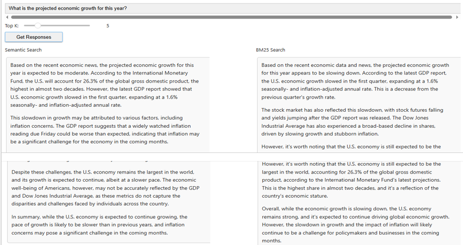
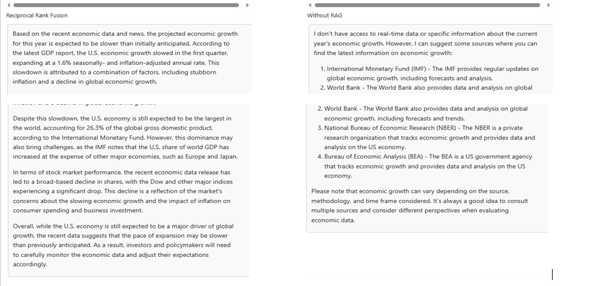
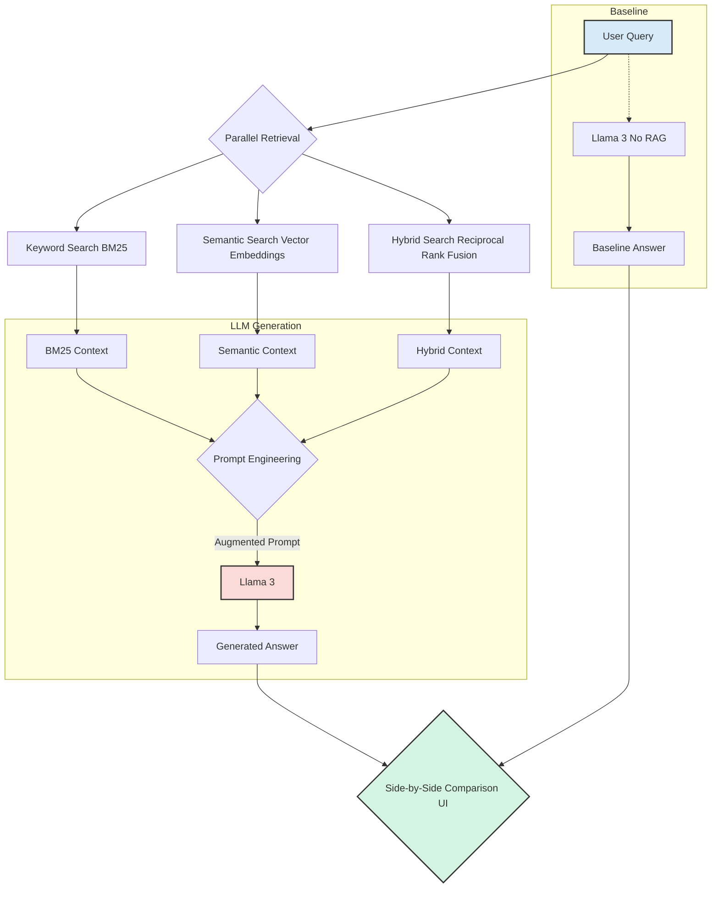
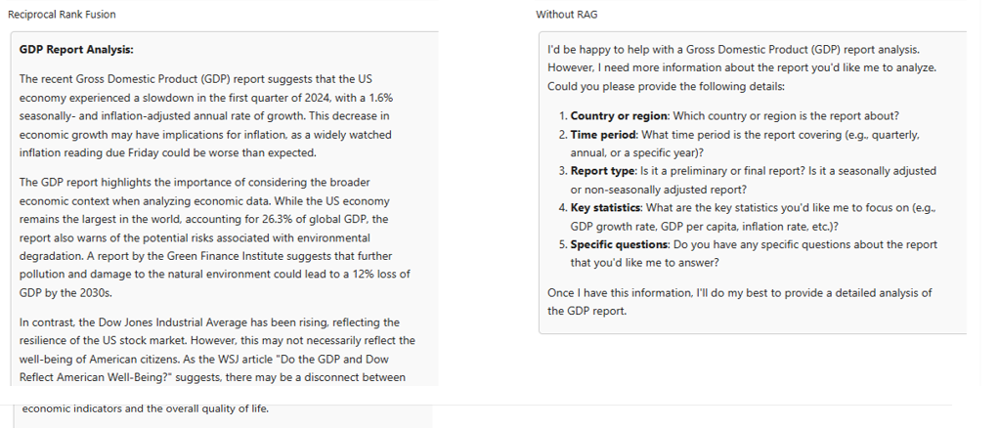
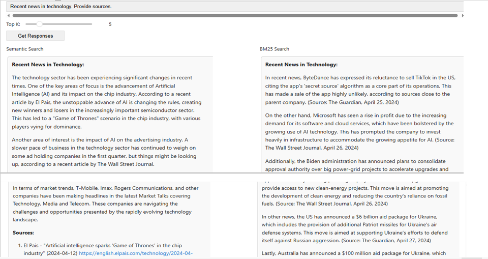
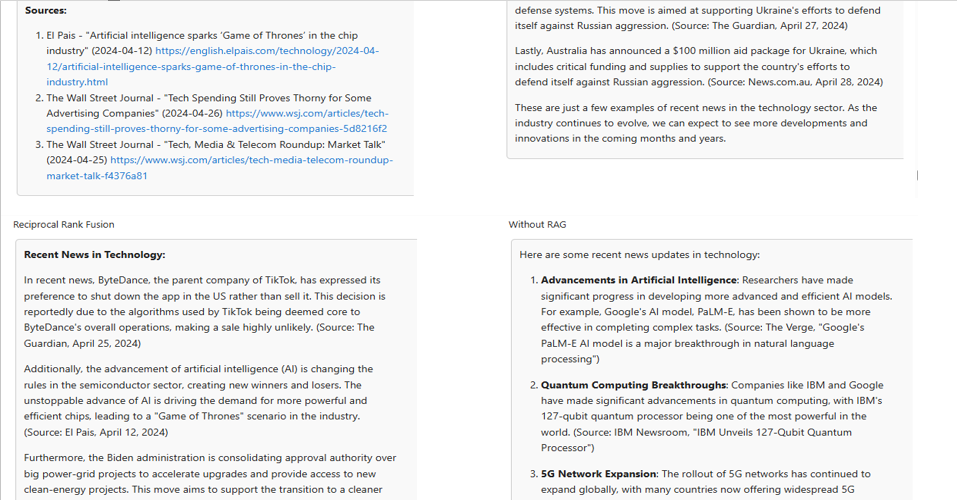
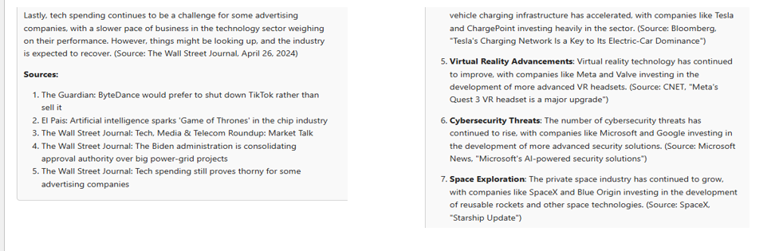

# 🚀 Advanced RAG: A Deep Dive into Hybrid Search for Superior LLM Answers

### Is your RAG system *really* retrieving the best context? This project proves that the retrieval strategy you choose is the difference between a good answer and a great one.

This repository provides an end-to-end implementation and **empirical comparison** of three foundational retrieval techniques for Retrieval-Augmented Generation (RAG). We dissect how **Lexical, Semantic, and Hybrid Search** fundamentally alter the context provided to a Large Language Model (**Llama 3**) and, consequently, the quality of its generated answers.




> Interactive widget comparing the outputs of different RAG strategies side-by-side.*

---

## 🎯 The Core Problem: Not All Retrievers Are Created Equal

A RAG system's intelligence is fundamentally limited by the quality of the information it retrieves. Relying on a single retrieval method can lead to critical gaps in context:
* **Keyword-based search** might miss conceptual nuances and synonyms.
* **Semantic search** can overlook important keywords and specific entity names.

This project tackles this problem by implementing and comparing the two paradigms, then fusing them into a **superior hybrid model** that gets the best of both worlds.

| Retrieval Strategy | How It Works | Strengths | Weaknesses |
| :--- | :--- | :--- | :--- |
| **Lexical (BM25)** | Matches the exact keywords in the query to documents. | **Precision:** Excellent for finding documents with specific names, acronyms, or jargon (e.g., "GDP," "T-Mobile"). | **Lack of Context:** Fails to understand synonyms or related concepts (e.g., "economic growth" vs. "GDP"). |
| **Semantic (Embeddings)**| Converts text to vectors and finds documents that are "conceptually" similar. | **Contextual Understanding:** Great at grasping the user's intent and finding relevant information even with different wording. | **Keyword Blindness:** Can sometimes miss documents that contain the exact keyword but are conceptually slightly different. |
| **Hybrid (RRF)** | Combines the *rankings* from both Lexical and Semantic searches to produce a final, robust list. | **Best of Both Worlds:** Balances keyword precision with contextual relevance, providing a richer, more reliable context to the LLM. | **Complexity:** Requires running and merging results from multiple systems. |

---

## 🔧 System Architecture

The project employs a parallel processing architecture to evaluate each retrieval strategy independently before feeding the results to the LLM.



---

## 📊 Live Results: Visual Comparison

Here are some examples from the interactive comparison widget, showcasing how each retriever performs on different types of queries. Each example demonstrates a crucial aspect of information retrieval for RAG systems.

### Example 1: Specific Query with Acronym ("GDP Report Analysis")

This query tests the system's ability to handle specific, technical terms and acronyms where keyword matching is important.




**Observation**:
* **BM25 (Lexical)** performs strongly, accurately retrieving documents containing the exact term "GDP."
* **Reciprocal Rank Fusion (Hybrid)** provides the most comprehensive answer. It captures the essential "GDP" articles found by BM25 but enriches the context with broader, semantically related articles (e.g., the disconnect between the Dow Jones and American well-being), leading to a more nuanced analysis.
* **Without RAG**, the model is completely unable to answer. It asks for the report instead of analyzing it, proving the absolute necessity of the RAG pipeline for context-specific tasks.

---

### Example 2: Conceptual Query ("Projected economic growth")

This query is broader and requires understanding the user's intent beyond simple keywords. This is where semantic understanding should shine.


**Observation**:
* **Semantic Search** correctly grasps the *concept* of "economic growth" and provides a relevant, summarized answer.
* **Reciprocal Rank Fusion (Hybrid)** again proves superior by creating a highly detailed and well-structured response. It synthesizes specific data points from the latest GDP reports (a strength of BM25) with the broader economic outlook (a strength of Semantic Search).
* **Without RAG**, the model gives a generic, unhelpful list of potential sources, completely failing to answer the user's actual question about the projection.

---

### Example 3: Broad Topic Query with Sources ("Recent news in technology")

This tests the system's ability to synthesize information on a general topic and ground its response in verifiable, up-to-date sources.





**Observation**:
* The three RAG methods provide distinct but relevant answers, each shaped by its retrieved context.
* **Reciprocal Rank Fusion (Hybrid)** constructs the most coherent narrative. It correctly identifies and prioritizes the most significant news items (ByteDance/TikTok, AI's impact on chips) that were highly ranked by *both* lexical and semantic retrievers.
* **Without RAG**, the answer is generic and references older, well-known events (like Google's PaLM-E or IBM's quantum computer). This highlights the RAG system's crucial ability to ground the LLM in **recent and timely** information from the provided documents.

---

## 🛠️ Tech Stack & Key Libraries

* **Core AI/ML**: `PyTorch`, `Transformers`, `Sentence-Transformers` (`BAAI/bge-base-en-v1.5`)
* **LLM**: `meta-llama/Meta-Llama-3.1-8B-Instruct-Turbo` via `together.ai` API
* **Retrieval Algorithms**: `bm2s` for BM25, `NumPy`/`SciPy` for cosine similarity
* **Data Handling**: `Pandas`, `joblib`
* **Tooling & Interface**: `Jupyter Notebook`, `ipywidgets`

---

## 🚀 Getting Started

You can replicate this analysis and experiment with your own queries.

### Prerequisites

* Python 3.8+
* An environment variable `TOGETHER_API_KEY` with your API key from [Together.ai](https://together.ai/).

### Installation

1.  **Clone the repository:**
    ```bash
    git clone [https://github.com/your-username/your-repo-name.git](https://github.com/your-username/your-repo-name.git)
    cd your-repo-name
    ```

2.  **Install the required dependencies:**
    ```bash
    pip install -r requirements.txt
    ```

### Running the Project

1.  Launch the Jupyter Notebook:
    ```bash
    jupyter notebook
    ```

2.  Open the `notebooks/Advanced_RAG_with_Hybrid_Search.ipynb` file and run the cells. The interactive widget will appear at the end for you to start querying!

---

## 🧠 Conclusion & Key Takeaways

This project empirically demonstrates that **Hybrid Search using Reciprocal Rank Fusion is a superior strategy** for building robust RAG systems.

* It mitigates the weaknesses of individual retrieval methods, ensuring that both **keyword precision** and **semantic context** are captured.
* By providing a more comprehensive and relevant context, it empowers the LLM to generate answers that are more accurate, detailed, and reliable.
* The choice of a retriever is not a minor detail—it is a critical architectural decision that has a direct and significant impact on the final output quality.
